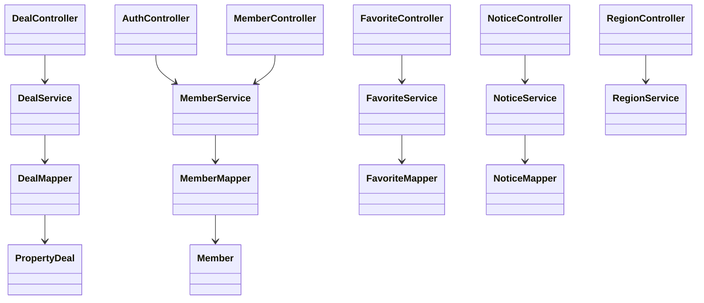

# SSAFY Home

Spring Boot와 MyBatis 기반의 주택 실거래가 검색 서비스입니다.

## 구현 범위

- 국토교통부 XML OpenAPI 연동 및 DB 저장
  - 아파트 매매: `RTMSDataSvcAptTradeDev`
  - 아파트 전월세: `RTMSDataSvcAptRent`
  - 연립다세대 매매: `RTMSDataSvcRHTrade`
  - 연립다세대 전월세: `RTMSDataSvcRHRent`
- 동별/단지명별 실거래가 검색
- 회원 가입, 조회, 수정, 삭제
- 세션 기반 로그인/로그아웃
- 관심지역 등록, 조회, 삭제
- 공지사항 등록, 수정, 삭제, 검색
- VWorld 시도/시군구/읍면동 API 프록시
- SGIS 인증 토큰 프록시

## 실행

```bash
./mvnw spring-boot:run
```

브라우저에서 `http://localhost:8080`으로 접속합니다.

DB는 MySQL만 사용합니다. 기본 접속 정보는 `root` 계정, 빈 비밀번호, `ssafyhome` 데이터베이스입니다. 다른 계정을 쓰려면 환경변수를 지정합니다.

```bash
DB_URL=jdbc:mysql://localhost:3306/ssafyhome?createDatabaseIfNotExist=true \
DB_USERNAME=root \
DB_PASSWORD=비밀번호 \
./mvnw spring-boot:run
```

STS에서는 프로젝트를 `Existing Maven Projects`로 import한 뒤 `SsafyhomeApplication.java`를 `Run As > Spring Boot App`으로 실행합니다.

공공데이터 인증키는 `application.yml`에 기본값으로 넣어두었습니다. 포털 승인 상태나 실행 환경에 따라 Encoding/Decoding 키 중 동작하는 값이 다를 수 있으므로, 필요하면 `PUBLIC_DATA_SERVICE_KEY` 환경변수로 교체합니다.

## 주요 API

| 기능 | Method | URL |
| --- | --- | --- |
| 실거래가 수집 | `POST` | `/api/deals/fetch?type=APT_TRADE&lawdCd=11110&dealYmd=202407` |
| 실거래가 검색 | `GET` | `/api/deals?dealType=APT_TRADE&lawdCd=11110&houseName=중흥` |
| 회원 가입 | `POST` | `/api/auth/register` |
| 로그인 | `POST` | `/api/auth/login` |
| 내 정보 | `GET` | `/api/auth/me` |
| 관심지역 | `GET/POST` | `/api/favorites` |
| 공지사항 | `GET/POST` | `/api/notices` |
| 시도 조회 | `GET` | `/api/regions/sido` |
| 시군구 조회 | `GET` | `/api/regions/sigungu?sidoCode=11` |
| 읍면동 조회 | `GET` | `/api/regions/dong?sigunguCode=11110` |
| SGIS 토큰 | `GET` | `/api/regions/sgis-token` |

## 클래스 다이어그램


