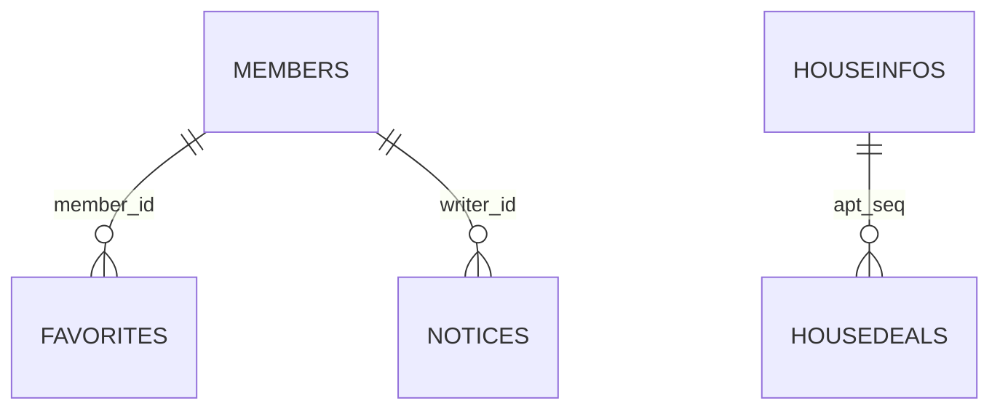

# 컬럼정의서

작성일: 2026-05-14  
기준 파일: `src/main/resources/schema.sql`

## 1. ERD 요약



## 2. members

회원 계정과 로그인 기준 테이블입니다.

| 컬럼 | 타입 | 제약 | 설명 |
|---|---|---|---|
| id | bigint | PK, auto_increment | 회원 ID |
| email | varchar(120) | not null, unique | 로그인 이메일 |
| password | varchar(100) | not null | BCrypt 암호화 비밀번호 |
| name | varchar(40) | not null | 이름 |
| phone | varchar(30) | nullable | 전화번호 |
| address | varchar(255) | nullable | 주소 |
| role | varchar(20) | not null, default USER | 권한 |
| created_at | timestamp | not null, default current_timestamp | 생성일 |
| updated_at | timestamp | not null, default current_timestamp on update | 수정일 |

## 3. property_deals

data.go.kr API에서 수집한 실거래 통합 테이블입니다.

| 컬럼 | 타입 | 제약 | 설명 |
|---|---|---|---|
| id | bigint | PK, auto_increment | 수집 거래 ID |
| deal_type | varchar(30) | not null | `APT_TRADE`, `APT_RENT`, `RH_TRADE`, `RH_RENT` |
| lawd_cd | varchar(10) | not null | 법정동 앞 5자리 지역 코드 |
| umd_nm | varchar(80) | nullable | 읍면동명 |
| house_name | varchar(160) | nullable | 단지/주택명 |
| house_type | varchar(40) | nullable | 주택 유형 |
| jibun | varchar(60) | nullable | 지번 |
| road_name | varchar(160) | nullable | 도로명 |
| build_year | int | nullable | 건축년도 |
| exclusive_area | decimal(12,4) | nullable | 전용면적 |
| land_area | decimal(12,4) | nullable | 대지면적 |
| deal_year | int | nullable | 계약년도 |
| deal_month | int | nullable | 계약월 |
| deal_day | int | nullable | 계약일 |
| deal_amount | bigint | nullable | 매매 금액, 만원 |
| deposit | bigint | nullable | 보증금, 만원 |
| monthly_rent | bigint | nullable | 월세, 만원 |
| floor | varchar(20) | nullable | 층 |
| deal_gbn | varchar(60) | nullable | 거래 구분 |
| raw_xml | text | nullable | 원본 XML 일부 |
| created_at | timestamp | not null, default current_timestamp | 저장일 |

인덱스:

| 이름 | 컬럼 | 목적 |
|---|---|---|
| idx_property_deals_region_month | lawd_cd, deal_year, deal_month | 지역/월 검색 |
| idx_property_deals_type_month | deal_type, lawd_cd, deal_year, deal_month | 유형/지역/월 재수집, 요약 |

## 4. dongcodes

법정동 코드 테이블입니다.

| 컬럼 | 타입 | 제약 | 설명 |
|---|---|---|---|
| dong_code | varchar(10) | PK, not null | 법정동 코드 |
| sido_name | varchar(30) | nullable | 시도명 |
| gugun_name | varchar(30) | nullable | 구군명 |
| dong_name | varchar(30) | nullable | 동명 |

## 5. houseinfos

아파트 단지 기본정보 테이블입니다.

| 컬럼 | 타입 | 제약 | 설명 |
|---|---|---|---|
| apt_seq | varchar(20) | PK, not null | 단지 식별자 |
| sgg_cd | varchar(5) | nullable | 시군구 코드 |
| umd_cd | varchar(5) | nullable | 읍면동 코드 |
| umd_nm | varchar(20) | nullable | 읍면동명 |
| jibun | varchar(10) | nullable | 지번 |
| road_nm_sgg_cd | varchar(5) | nullable | 도로명 시군구 코드 |
| road_nm | varchar(20) | nullable | 도로명 |
| road_nm_bonbun | varchar(10) | nullable | 도로명 본번 |
| road_nm_bubun | varchar(10) | nullable | 도로명 부번 |
| apt_nm | varchar(40) | nullable | 아파트명 |
| build_year | int | nullable | 건축년도 |
| latitude | varchar(45) | nullable | 위도 |
| longitude | varchar(45) | nullable | 경도 |

## 6. housedeals

단지별 거래 이력 테이블입니다.

| 컬럼 | 타입 | 제약 | 설명 |
|---|---|---|---|
| no | int | PK, auto_increment | 거래 번호 |
| apt_seq | varchar(20) | FK nullable | `houseinfos.apt_seq` 참조 |
| apt_dong | varchar(40) | nullable | 아파트 동 |
| floor | varchar(3) | nullable | 층 |
| deal_year | int | nullable | 거래년도 |
| deal_month | int | nullable | 거래월 |
| deal_day | int | nullable | 거래일 |
| exclu_use_ar | decimal(7,2) | nullable | 전용면적 |
| deal_amount | varchar(10) | nullable | 거래금액 |

인덱스:

| 이름 | 컬럼 | 목적 |
|---|---|---|
| idx_housedeals_apt_seq | apt_seq | 단지 상세 거래 조회 |

## 7. favorites

회원별 관심지역 테이블입니다.

| 컬럼 | 타입 | 제약 | 설명 |
|---|---|---|---|
| id | bigint | PK, auto_increment | 관심지역 ID |
| member_id | bigint | FK, not null | `members.id` 참조 |
| sido_nm | varchar(80) | nullable | 시도명 |
| sigungu_nm | varchar(80) | nullable | 시군구명 |
| dong_nm | varchar(80) | nullable | 동명 |
| lawd_cd | varchar(10) | not null | 지역 코드 |
| memo | varchar(255) | nullable | 메모 |
| created_at | timestamp | not null, default current_timestamp | 생성일 |

FK:

```text
favorites.member_id -> members.id on delete cascade
```

## 8. notices

공지사항 테이블입니다.

| 컬럼 | 타입 | 제약 | 설명 |
|---|---|---|---|
| id | bigint | PK, auto_increment | 공지 ID |
| title | varchar(200) | not null | 제목 |
| content | text | not null | 내용 |
| writer_id | bigint | FK nullable | `members.id` 참조 |
| view_count | int | not null, default 0 | 조회수 |
| created_at | timestamp | not null, default current_timestamp | 생성일 |
| updated_at | timestamp | not null, default current_timestamp on update | 수정일 |

FK:

```text
notices.writer_id -> members.id on delete set null
```

## 9. 업무상 참고 관계

명시 FK는 없지만 코드상 함께 사용되는 관계입니다.

| 관계 | 설명 |
|---|---|
| `dongcodes.dong_code = concat(houseinfos.sgg_cd, houseinfos.umd_cd)` | 단지 검색 시 지역명 표시 |
| `property_deals.lawd_cd` | 실거래 수집/검색의 지역 기준 |
| `favorites.lawd_cd` | 관심지역 지역 코드 |

## 10. DB 변경 시 확인 사항

1. `schema.sql`
2. Entity/DTO Java 클래스
3. MyBatis Mapper XML
4. `AdminController`의 허용 테이블/컬럼 설정
5. JSP/JS 테이블 렌더링
6. `docs/ERD.md`와 본 컬럼정의서
