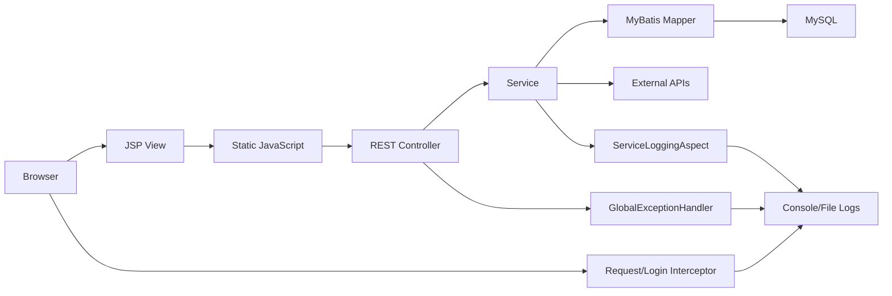
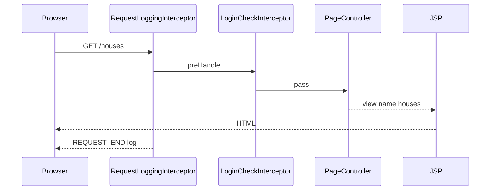
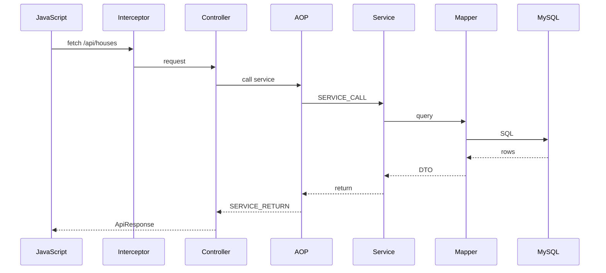
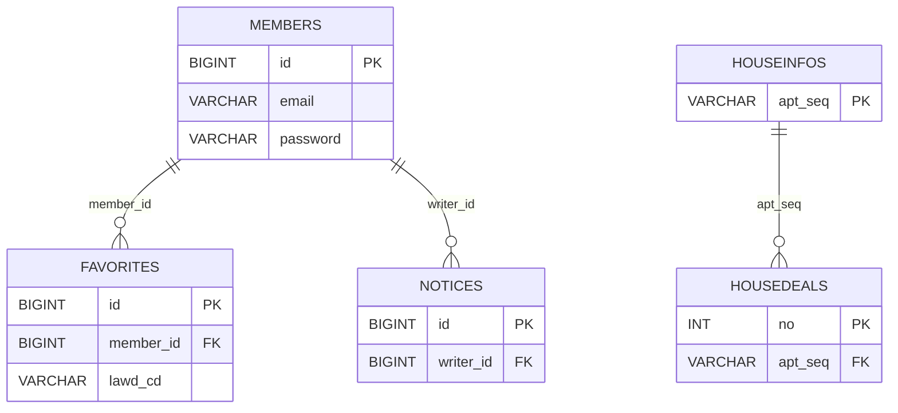
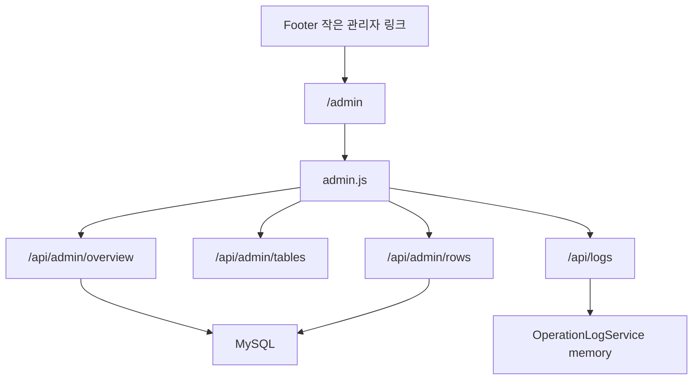

# 현재 아키텍처 문서

작성일: 2026-05-14

## 1. 아키텍처 요약

SSAFY Home은 JSP 기반 Spring MVC 웹 애플리케이션입니다.

## 2. 계층 구조

| 계층 | 구현 |
|---|---|
| View | JSP |
| Client Logic | Vanilla JS |
| API | Spring MVC REST Controller |
| Business | Service |
| Persistence | MyBatis Mapper XML |
| DB | MySQL |
| Auth | Session + Interceptor |
| Logging | Interceptor + AOP + Logback |
| Error | ControllerAdvice |

## 3. 요청 흐름

### 페이지 요청

### API 요청

## 4. 도메인 흐름

| 도메인 | 흐름 |
|---|---|
| 회원 | JSP → `members.js` → `AuthController`/`MemberController` → `MemberService` → `MemberMapper` |
| 실거래 | JSP → `deals.js` → `DealController` → `DealService` → data.go.kr/MyBatis |
| 단지 | JSP → `houses.js` → `HouseController` → `HouseService` → `HouseMapper` |
| 관심지역 | JSP → `favorites.js` → `FavoriteController` → `FavoriteService` → `FavoriteMapper` |
| 공지 | JSP → `notices.js` → `NoticeController` → `NoticeService` → `NoticeMapper` |
| 지역 | JSP → `regions.js` → `RegionController` → `RegionService` → DB/VWorld/SGIS |
| 관리자 | JSP → `admin.js` → `AdminController`/`OperationLogController` → DB/OperationLogService |

## 5. 데이터 관계

## 6. 공통 처리

| 공통 처리 | 담당 | 설명 |
|---|---|---|
| 요청 로그 | `RequestLoggingInterceptor` | requestId, status, duration |
| 로그인 보호 | `LoginCheckInterceptor` | 세션 검사 |
| Service 로그 | `ServiceLoggingAspect` | 호출 파라미터, 반환값 |
| 예외 처리 | `GlobalExceptionHandler` | 오류 JSON 통일 |
| 작업 로그 | `OperationLogService` | 사용자 작업 로그 |

## 7. 관리자 구조

관리자는 일반 사용 흐름과 분리됩니다.

## 8. 현재 설계상 주의

| 항목 | 설명 |
|---|---|
| 관리자 권한 | 현재는 로그인 여부만 확인. role 기반 ADMIN 제한은 추가 가능 |
| 작업 로그 | 메모리 기반이라 서버 재시작 시 초기화 |
| VWorld | 키 권한 문제 시 502 오류 |
| 대용량 테이블 | `housedeals`는 관리자 overview에서 추정 count 사용 |
| JSP | WAR 패키징과 Jasper 의존성 필요 |
