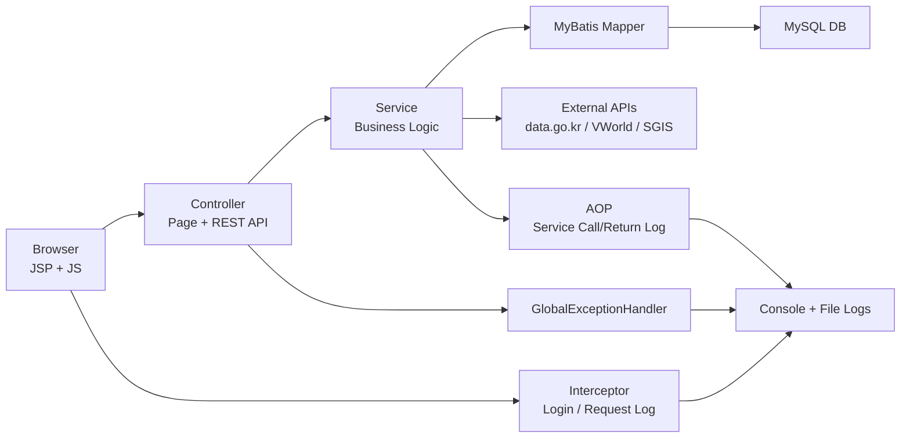
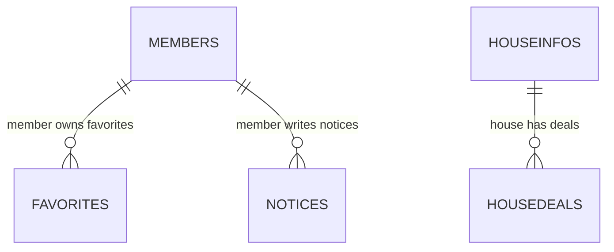
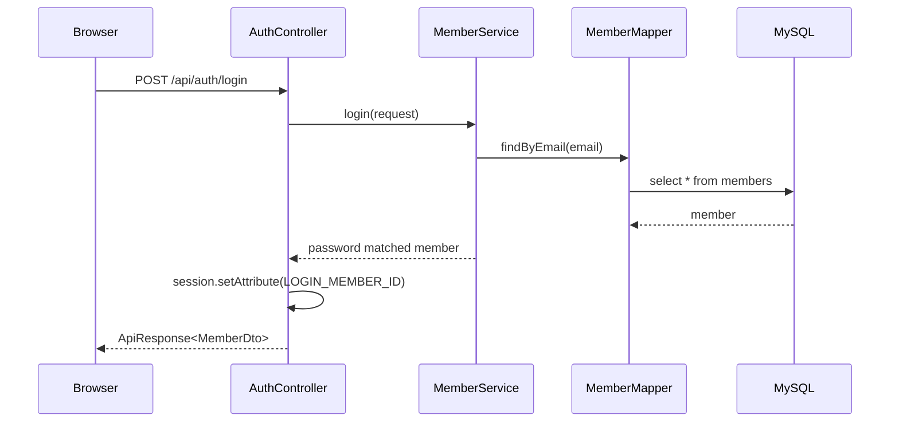
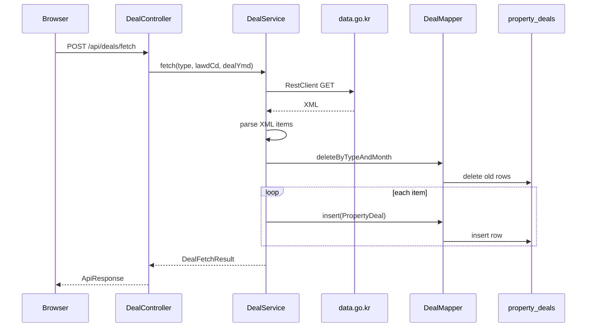
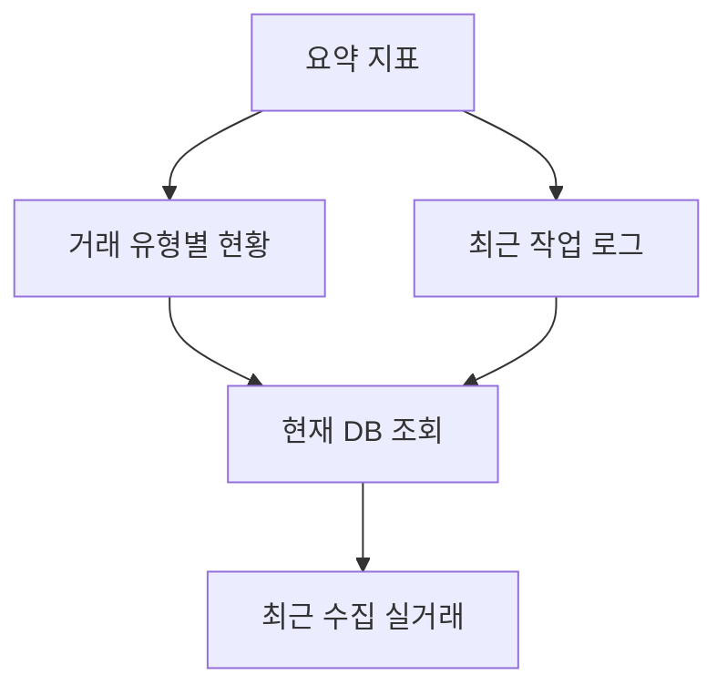

# 빈 폴더에서 SSAFY Home 프로젝트를 만들기까지

이 문서는 아무 파일도 없는 빈 폴더에서 현재 SSAFY Home 프로젝트를 만든다고 가정했을 때 필요한 사고 흐름, 기술 선택, 구현 순서, 검증 방법을 정리한 문서입니다.  
실제 구현 세부 코드는 프로젝트 소스에 있고, 이 문서는 “왜 이런 구조가 되었는지”와 “무엇을 먼저 이해해야 하는지”를 설명합니다.

## 1. 목표 정의

먼저 프로젝트를 단순 CRUD 예제가 아니라 **실제 서비스되는 부동산 정보 제공 웹사이트**로 잡는다.

핵심 목표는 다음과 같다.

| 목표 | 설명 |
|---|---|
| 실거래 데이터 제공 | data.go.kr API를 호출해 아파트/연립다세대 매매·전월세 데이터를 수집하고 조회 |
| 기존 DB 활용 | 제공된 `SSAFY_HOME_Schema.sql`, dump 데이터를 기반으로 단지/거래/법정동 정보 조회 |
| JSP 기반 MVC | Spring Boot + Controller + Service + Mapper + JSP View 구조 |
| 로그인 세션 | 로그인 상태는 `HttpSession`으로 관리 |
| UI/UX | 실제 부동산 서비스처럼 탐색, 검색, 요약, 관리자 대시보드 제공 |
| 로그/관리 | 작업 로그, 요청 로그, Service AOP 로그, 에러 로그를 콘솔과 파일에 저장 |
| 운영자 화면 | footer 하단의 작은 관리자 링크로 진입, DB 조회/로그 조회/요약 지표 확인 |

이 목표를 기준으로 “기능을 많이 붙이는 것”보다 **정석적인 MVC 구조와 유지보수 가능한 흐름**을 우선한다.

## 2. 필요한 기술

### 백엔드

| 기술 | 필요한 이유 |
|---|---|
| Java 21 | Spring Boot 3.x 실행 기반 |
| Spring Boot 3.5.14 | 웹 서버, DI, MVC, 설정 자동화 |
| Spring Web MVC | Controller, REST API, JSP View 라우팅 |
| JSP + Jasper | `/WEB-INF/views/*.jsp` 렌더링 |
| MyBatis | SQL을 명시적으로 관리하고 SSAFY DB 구조와 잘 맞춤 |
| MySQL Driver | MySQL `ssafy_home` DB 연결 |
| Spring Validation | `@Valid` 기반 요청값 검증 |
| Spring AOP | Service 계층 호출/반환 자동 로그 |
| Spring Security Crypto | BCrypt 비밀번호 암호화만 사용 |
| Lombok | `@RequiredArgsConstructor`, `@Slf4j`로 반복 코드 감소 |
| RestClient | 외부 공공 API 호출 |
| Logback | 콘솔/파일/에러 로그 분리와 rolling 정책 |

### 프론트엔드

| 기술 | 필요한 이유 |
|---|---|
| JSP | 서버 사이드 View |
| HTML/CSS | 서비스 화면 구성 |
| Vanilla JavaScript | API 호출, 테이블 렌더링, 다크모드, 에러 표시 |
| Cookie | 다크모드 같은 사용자 표시 설정 저장 |
| Fetch API | REST API 호출 |

### DB/데이터

| 기술 | 필요한 이유 |
|---|---|
| MySQL | 제공된 SSAFY Home DB와 연동 |
| SQL DDL | `members`, `favorites`, `notices`, `property_deals` 추가 |
| Index | 실거래 지역/월/유형 검색 성능 확보 |
| ERD | 테이블 관계와 업무 참조 관계 정리 |

### 운영/검증

| 기술 | 필요한 이유 |
|---|---|
| Maven Wrapper | 환경 차이 없이 빌드 |
| curl | API smoke test |
| Browser 검증 | 실제 JSP 화면 렌더링 확인 |
| 로그 파일 | 장애 확인, 작업 추적 |

## 3. 전체 아키텍처



핵심 원칙은 다음과 같다.

| 원칙 | 적용 |
|---|---|
| Controller는 얇게 | 요청/응답, 세션, 작업 로그 호출 정도만 담당 |
| Service에 비즈니스 집중 | 외부 API 호출, XML 파싱, DB 저장, 검증 |
| Mapper는 SQL 담당 | 복잡한 조회/집계는 XML Mapper에 명확히 작성 |
| 공통 관심사는 분리 | 로그인은 Interceptor, Service 로그는 AOP, 예외는 ControllerAdvice |
| JSP는 View만 | 복잡한 로직은 JS/API로 처리 |

## 4. 빈 폴더에서 시작하는 구현 순서

### 4.1 프로젝트 생성

빈 폴더에서 Spring Boot 프로젝트를 만든다.

선택 기준:

| 선택 | 이유 |
|---|---|
| Maven | SSAFY/Spring Boot 기본 실습 흐름과 친숙 |
| WAR packaging | JSP 포함 프로젝트에 적합 |
| Java 21 | 현재 환경과 Spring Boot 3.5.x에 맞춤 |

필수 의존성:

```xml
<!-- Spring MVC, REST API, 내장 Tomcat 기반 -->
<dependency>
    <groupId>org.springframework.boot</groupId>
    <artifactId>spring-boot-starter-web</artifactId>
</dependency>

<!-- JSP 렌더링 -->
<dependency>
    <groupId>org.apache.tomcat.embed</groupId>
    <artifactId>tomcat-embed-jasper</artifactId>
</dependency>

<!-- MyBatis + MySQL -->
<dependency>
    <groupId>org.mybatis.spring.boot</groupId>
    <artifactId>mybatis-spring-boot-starter</artifactId>
    <version>3.0.5</version>
</dependency>
<dependency>
    <groupId>com.mysql</groupId>
    <artifactId>mysql-connector-j</artifactId>
    <scope>runtime</scope>
</dependency>

<!-- AOP 로그 -->
<dependency>
    <groupId>org.springframework.boot</groupId>
    <artifactId>spring-boot-starter-aop</artifactId>
</dependency>

<!-- 요청 검증, Lombok, BCrypt -->
```

### 4.2 기본 설정 작성

`application.yml`에서 먼저 결정할 것:

| 설정 | 이유 |
|---|---|
| JSP prefix/suffix | Controller가 `"home"`을 반환하면 `/WEB-INF/views/home.jsp`로 이동 |
| datasource | MySQL 계정 `ssafy/ssafy`, DB `ssafy_home` |
| sql.init.mode | `schema.sql` 자동 실행 |
| mybatis.mapper-locations | XML Mapper 위치 지정 |
| 외부 API key | data.go.kr, VWorld, SGIS 키 관리 |

이 단계에서 DB 연결 실패가 가장 많이 발생하므로, 먼저 `mvn test`로 ApplicationContext가 뜨는지 확인한다.

### 4.3 DB 스키마 구성

기존 제공 DB:

| 테이블 | 목적 |
|---|---|
| `dongcodes` | 법정동 코드 |
| `houseinfos` | 아파트 단지 기본정보 |
| `housedeals` | 단지별 거래 이력 |

서비스 기능을 위해 추가할 테이블:

| 테이블 | 목적 |
|---|---|
| `members` | 회원/로그인 |
| `favorites` | 회원별 관심지역 |
| `notices` | 공지사항 |
| `property_deals` | 외부 API 수집 실거래 통합 저장 |

관계는 다음처럼 잡는다.



실거래 API 수집 데이터인 `property_deals`는 외부 데이터 성격이 강하므로 기존 단지 테이블과 강한 FK로 묶지 않는다. 대신 `lawd_cd`, `house_name`, `deal_year/month` 기준으로 검색/분석한다.

### 4.4 MVC 패키지 구조 설계

기능별 패키지를 나눈다.

```text
com.ssafy.home
├─ common      공통 응답, 예외, 관리자, 작업 로그, AOP
├─ config      WebConfig, Interceptor
├─ member      회원/로그인
├─ deal        외부 API 실거래 수집/검색/요약
├─ house       기존 DB 단지/거래 조회
├─ favorite    관심지역
├─ notice      공지사항
└─ region      법정동/VWorld/SGIS 지역 정보
```

이 구조의 장점:

| 장점 | 설명 |
|---|---|
| 기능별 응집 | Controller/Service/Mapper/DTO가 가까이 있음 |
| 확장 쉬움 | 새 기능 추가 시 새 패키지를 만들면 됨 |
| 의존 흐름 명확 | Controller → Service → Mapper |

## 5. 기능별 구현 사고 흐름

### 5.1 회원/로그인

요구사항:

| 요구 | 구현 |
|---|---|
| 로그인 상태는 세션 | `HttpSession`에 `LOGIN_MEMBER_ID` 저장 |
| 비밀번호 보호 | BCrypt hash 저장 |
| 로그인 필요한 기능 보호 | `LoginCheckInterceptor` |

흐름:



왜 Spring Security 전체를 쓰지 않았는가:

| 이유 | 설명 |
|---|---|
| 과제 맥락 | Interceptor 활용 요구가 있음 |
| 단순성 | 세션 로그인과 권한 체크만 필요 |
| 학습 효과 | MVC Interceptor 흐름을 직접 확인 가능 |

### 5.2 실거래 API 수집

핵심 어려움:

| 어려움 | 대응 |
|---|---|
| API 유형이 여러 개 | `DealType` enum으로 endpoint 구분 |
| XML 응답 파싱 | DOM Parser로 item 반복 처리 |
| 재수집 중복 | 같은 유형/지역/월 삭제 후 insert |
| 매매/전월세 필드 차이 | `deal_amount`, `deposit`, `monthly_rent`를 nullable로 분리 |
| API 오류 | `ExternalApiException`으로 감싸고 502 반환 |

수집 흐름:



### 5.3 기존 DB 단지 검색

기존 DB에는 전국 단지/거래가 많으므로 검색 성능과 화면 표시를 고려해야 한다.

구현 판단:

| 판단 | 설명 |
|---|---|
| 단지 목록은 100건 제한 | 브라우저 테이블 과부하 방지 |
| 거래 이력은 200건 제한 | 상세 패널 크기 제어 |
| `dongcodes` left join | 지역명 표시를 위해 `concat(sgg_cd, umd_cd)`로 연결 |
| 최신 거래 표시 | `group_concat + order by`로 최신 거래월/금액 추출 |

### 5.4 관심지역

관심지역은 반드시 로그인 사용자의 데이터만 조회/삭제해야 한다.

핵심 정책:

| 정책 | 구현 |
|---|---|
| 목록 조회 | session의 memberId 기준 |
| 등록 | request + session memberId |
| 삭제 | `where id = ? and member_id = ?` |
| 접근 보호 | `/favorites`, `/api/favorites/**`를 Interceptor 보호 경로에 등록 |

### 5.5 공지사항

공지사항은 단순 CRUD지만, 운영 로그와 조회수 증가가 필요하다.

구현:

| 기능 | 구현 |
|---|---|
| 목록 | 키워드 검색 |
| 상세 | 조회수 증가 후 상세 반환 |
| 작성/수정/삭제 | OperationLogService로 작업 로그 기록 |

### 5.6 지역 정보

지역 정보는 두 종류로 나눈다.

| 종류 | 설명 |
|---|---|
| 내부 DB 지역 | `dongcodes` 기반 시도/시군구/동 조회 |
| 외부 지역 API | VWorld, SGIS 호출 응답 확인 |

외부 API는 키 오류, 응답 오류 가능성이 높으므로 브라우저에 502 JSON으로 명확히 보여준다.

### 5.7 관리자 대시보드

관리자 페이지는 실제 서비스에서 자주 보는 운영 화면처럼 구성한다.

필요한 정보:

| 영역 | 내용 |
|---|---|
| 요약 지표 | 회원 수, 수집 실거래 수, 단지 수, 최근 거래월 |
| 거래 유형별 현황 | APT_TRADE, APT_RENT, RH_TRADE, RH_RENT별 적재 건수 |
| 작업 로그 | 회원/관심지역/공지/수집 작업 로그 |
| 현재 DB 조회 | 테이블 선택, 키워드 필터, 표시 개수 |
| 최근 수집 거래 | 최신 property_deals |

주의한 점:

| 문제 | 대응 |
|---|---|
| `housedeals`가 매우 큼 | 관리자 overview에서는 `information_schema.tables.table_rows` 추정값 사용 |
| 임의 SQL 위험 | 허용된 테이블 목록만 조회 |
| 관리자 링크 노출 | 상단 탭이 아니라 footer 하단 작은 링크로 이동 |

## 6. 공통 관심사 분리

### 6.1 요청 로그 Interceptor

모든 요청의 시작과 종료를 남긴다.

기록 내용:

| 항목 | 이유 |
|---|---|
| requestId | 같은 요청의 Controller/Service/Exception 로그 연결 |
| method, uri, query | 어떤 요청인지 식별 |
| status, durationMs | 성공/실패와 속도 확인 |
| sessionId, memberId | 로그인 사용자 맥락 확인 |
| handler | 어떤 Controller 메서드가 처리했는지 확인 |

### 6.2 로그인 권한 Interceptor

로그인이 필요한 기능:

| 경로 | 이유 |
|---|---|
| `/favorites` | 개인 관심지역 |
| `/admin` | 운영자 화면 |
| `/api/favorites/**` | 개인 데이터 API |
| `/api/admin/**` | DB 조회/운영 데이터 API |
| `/api/logs/**` | 작업 로그 조회 |
| `/api/deals/fetch*` | 데이터 적재 작업 |

응답 정책:

| 요청 | 처리 |
|---|---|
| 페이지 | `/members?redirect=원래경로`로 이동 |
| API | `401 LOGIN_REQUIRED` JSON 반환 |

### 6.3 Service AOP 로그

Service 전체에 대해 다음 로그를 자동으로 남긴다.

| Advice | 내용 |
|---|---|
| `@Before` | 클래스명, 메서드명, Signature, 파라미터 |
| `@AfterReturning` | 클래스명, 메서드명, Signature, 반환값 |

이 방식의 장점:

| 장점 | 설명 |
|---|---|
| 중복 제거 | 모든 Service에 직접 로그를 쓰지 않아도 됨 |
| 흐름 추적 | Controller 요청 로그와 같은 requestId로 연결 |
| 디버깅 편의 | 어떤 파라미터로 호출되어 무엇을 반환했는지 확인 |

주의점:

| 주의 | 설명 |
|---|---|
| 민감정보 | password, serviceKey, key 등은 마스킹 |
| 긴 반환값 | 너무 긴 값은 잘라서 로그 파일 과다 증가 방지 |

### 6.4 전역 예외 처리

Controller마다 try/catch를 두지 않고 `@ControllerAdvice`로 모은다.

| 예외 | 응답 |
|---|---|
| 검증 실패 | 400 |
| 로그인 필요 | 401 |
| 외부 API 실패 | 502 |
| 기타 서버 오류 | 500 |

브라우저 JS는 `success:false` 또는 HTTP error를 감지해 상단 에러 박스로 표시한다.

## 7. UI/UX 설계

### 홈

홈은 단순 소개 페이지가 아니라 실제 사용자가 바로 검색을 시작할 수 있는 진입점으로 만든다.

구성:

| 영역 | 목적 |
|---|---|
| Hero | 서비스 정체성 전달 |
| CTA | 단지 검색, 실거래 조회로 즉시 이동 |
| 스냅샷 | 어떤 데이터를 제공하는지 빠르게 이해 |
| 기능 카드 | 주요 기능 이동 |

### 관리자 링크

요구사항에 따라 상단 네비게이션의 관리자 탭은 숨기고, footer 하단 오른쪽의 작은 링크로만 제공한다.

이유:

| 이유 | 설명 |
|---|---|
| 일반 사용자 UX | 관리자 메뉴가 주 사용 흐름을 방해하지 않음 |
| 운영자 접근 | 스크롤 하단에서 접근 가능 |
| 구현 단순성 | `common.js`에서 footer를 공통 생성 |

### 관리자 화면

관리자 화면은 “운영 상황을 한눈에 보는 화면”이어야 한다.

그래서 단순 로그 목록 대신 다음 구조로 만든다.



## 8. 파일을 만드는 순서

빈 폴더 기준 추천 순서:

1. `pom.xml`
2. `SsafyhomeApplication.java`
3. `application.yml`
4. `schema.sql`
5. `common` 응답/예외 클래스
6. `config` WebConfig/Interceptor
7. `member` 로그인 기능
8. `PageController` + 기본 JSP
9. `house` 기존 DB 조회
10. `deal` 외부 API 수집
11. `favorite`, `notice`, `region`
12. `OperationLogService`, 관리자 API
13. `ServiceLoggingAspect`
14. `logback-spring.xml`
15. CSS/JS UI 정리
16. ERD/코드 설명 문서 작성

## 9. 검증 순서

### 빌드

```powershell
.\mvnw.cmd -q clean package
```

확인할 것:

| 확인 | 의미 |
|---|---|
| ApplicationContext 로딩 | Bean, DB, Mapper 설정 정상 |
| WAR 생성 | JSP 포함 패키징 정상 |
| 테스트 통과 | 최소 기동 검증 성공 |

### 서버 실행

```powershell
java -Dfile.encoding=UTF-8 -jar target\ssafyhome-0.0.1-SNAPSHOT.war
```

### 기본 smoke test

```powershell
curl.exe -s -o NUL -w "%{http_code}" http://localhost:8080/
curl.exe -s "http://localhost:8080/api/deals/summary?lawdCd=11110&dealYmd=202407"
curl.exe -s -i "http://localhost:8080/api/favorites"
curl.exe -s -i "http://localhost:8080/admin"
```

예상:

| 요청 | 예상 |
|---|---|
| `/` | 200 |
| `/api/deals/summary` | 200 |
| `/api/favorites` 비로그인 | 401 |
| `/admin` 비로그인 | `/members?redirect=/admin` 302 |

### 로그 확인

확인 파일:

| 파일 | 내용 |
|---|---|
| `logs/ssafyhome.log` | 전체 요청/Service/작업 로그 |
| `logs/ssafyhome-error.log` | ERROR 이상 로그 |
| IDE 콘솔 | 파일 로그와 같은 패턴 |

찾아볼 키워드:

```text
REQUEST_START
REQUEST_END
AUTH_REQUIRED
AUTH_PASS
SERVICE_CALL
SERVICE_RETURN
OPERATION_LOG
```

## 10. 흔한 문제와 해결

| 문제 | 원인 | 해결 |
|---|---|---|
| `sqlSessionTemplate` Bean 오류 | DB 연결 실패 또는 MyBatis 설정 실패 | datasource 계정/비밀번호, MySQL 실행 여부 확인 |
| `Access denied for user root` | 기본 계정이 root로 잡힘 | `DB_USERNAME=ssafy`, `DB_PASSWORD=ssafy` 또는 yml 확인 |
| JSP가 다운로드되거나 404 | Jasper 또는 view prefix/suffix 문제 | `tomcat-embed-jasper`, `/WEB-INF/views`, `application.yml` 확인 |
| VWorld `INCORRECT_KEY` | 키 권한/등록 도메인/API 설정 문제 | VWorld 콘솔에서 키 상태 확인 |
| 한글 로그 깨짐 | 인코딩 불일치 | `-Dfile.encoding=UTF-8`, logback charset UTF-8 |
| 관리자 overview 느림 | 대용량 테이블 count | `housedeals`는 metadata 추정값 사용 |
| API 401 | 로그인 세션 없음 | `/members`에서 로그인/가입 후 재시도 |

## 11. 앞으로 확장한다면

| 확장 | 방향 |
|---|---|
| 실제 지도 | VWorld 지도 또는 Kakao/Leaflet 연동 |
| 관리자 권한 분리 | `members.role = ADMIN`만 `/admin` 허용 |
| 수집 스케줄링 | Spring Scheduler 또는 배치 |
| 로그 영속화 | OperationLog를 DB 테이블로 저장 |
| 검색 성능 | full-text index 또는 별도 검색 테이블 |
| 테스트 강화 | Controller MockMvc, Service 단위 테스트, Mapper 통합 테스트 |

## 12. 요약

이 프로젝트를 빈 폴더에서 만든다면 핵심 사고 순서는 다음과 같다.

1. “실제 부동산 정보 서비스”라는 목표를 먼저 정한다.
2. Spring Boot MVC + JSP + MyBatis + MySQL이라는 정석 구조를 잡는다.
3. 기존 DB 조회와 외부 API 수집 데이터를 분리한다.
4. 로그인/로그/예외 같은 공통 관심사는 Interceptor, AOP, ControllerAdvice로 분리한다.
5. 일반 사용자 화면과 관리자 화면의 목적을 다르게 설계한다.
6. 빌드, API, 브라우저, 로그 파일까지 끝까지 검증한다.
