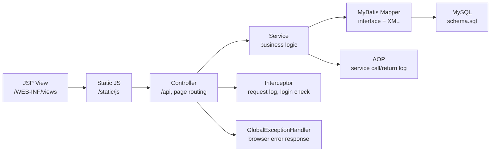

# SSAFY Home Code Overview

이 문서는 프로젝트의 모든 주요 코드와 설정 파일이 **무엇을 담당하는지**, **수정하면 어디에 영향이 가는지**를 빠르게 파악하기 위한 코드 주석형 가이드입니다.  
코드 내부에는 설정/의존성/로그처럼 영향 범위가 큰 부분에 직접 주석을 달고, 파일별 상세 설명은 이 문서에서 관리합니다.

## 전체 구조

## 루트 설정

| 파일 | 역할 | 변경 시 영향 |
|---|---|---|
| `pom.xml` | Spring Boot 버전, WAR 패키징, Web/AOP/MyBatis/MySQL/JSP/Lombok/Test 의존성 관리 | 의존성 추가/삭제 시 빌드, 런타임 Bean 구성, JSP 렌더링, DB 연결, AOP 로그 동작에 직접 영향 |
| `src/main/resources/application.yml` | JSP ViewResolver, MySQL 접속, MyBatis 매퍼, 세션, 외부 API 키 설정 | DB 계정, JSP 경로, API 키, 세션 만료 시간 변경에 영향 |
| `src/main/resources/logback-spring.xml` | 콘솔/파일/에러 파일 로그 패턴과 rolling 정책 | IDE 콘솔 로그와 파일 로그 형식, 에러 파일 분리, requestId 추적에 영향 |
| `src/main/resources/schema.sql` | 애플리케이션이 사용하는 기본 테이블 생성 | DB 구조, Mapper SQL, 관리자 대시보드 조회 대상에 영향 |

## 공통 계층

| 파일 | 역할 | 변경 시 영향 |
|---|---|---|
| `SsafyhomeApplication.java` | Spring Boot 시작점 | Component scan, 설정 로딩, 전체 애플리케이션 기동에 영향 |
| `PageController.java` | `/`, `/deals`, `/houses`, `/members`, `/favorites`, `/notices`, `/regions`, `/admin` JSP 라우팅 | URL과 JSP 파일 연결에 영향. view name 변경 시 JSP 파일명도 맞춰야 함 |
| `ApiResponse.java` | 정상 API 응답 공통 포맷 `{success, message, data}` | 프론트 `common.js`의 `parseResponse`와 모든 API 응답 화면 처리에 영향 |
| `ErrorResponse.java` | 오류 API 응답 공통 포맷 | 브라우저 에러 표시, 관리자/일반 API 실패 응답에 영향 |
| `ExternalApiException.java` | 외부 공공 API 실패를 명확히 구분하는 예외 | GlobalExceptionHandler가 502로 변환하는 기준 |
| `GlobalExceptionHandler.java` | `@ControllerAdvice` 기반 전역 예외 처리 | 브라우저에 표시되는 오류 메시지, HTTP status, 에러 로그 파일에 영향 |
| `OperationLog.java` | 화면에서 조회하는 작업 로그 record | 관리자 로그 화면 표시 컬럼에 영향 |
| `OperationLogService.java` | 회원/관심지역/공지/수집 작업 로그를 메모리에 저장하고 파일 로그에도 기록 | 관리자 로그 조회, STS 콘솔/파일 로그의 작업 추적에 영향 |
| `OperationLogController.java` | `/api/logs` 작업 로그 조회 API | 관리자 대시보드 로그 필터에 영향 |
| `AdminController.java` | `/api/admin/*` 관리자 대시보드, 테이블 목록, DB 행 조회 API | 관리자 페이지 요약 지표와 DB 조회 테이블/필터에 영향 |
| `ServiceLoggingAspect.java` | `@Aspect`, `@Before`, `@AfterReturning`으로 Service 호출/반환 로그 자동 기록 | Service 전체 로그량, 파라미터/리턴값 노출 범위, 문제 추적 흐름에 영향 |

## 설정/인터셉터 계층

| 파일 | 역할 | 변경 시 영향 |
|---|---|---|
| `WebConfig.java` | `RestClient` Bean 등록, 요청 로깅 Interceptor와 로그인 Interceptor 등록 | 외부 API 호출 객체, 보호 URL 목록, 모든 요청 로깅 적용 범위에 영향 |
| `RequestLoggingInterceptor.java` | 요청 시작/종료/예외 로그, requestId MDC 저장 | 콘솔/파일 로그에서 요청 단위 추적 가능 여부에 영향 |
| `LoginCheckInterceptor.java` | 로그인 필요한 페이지/API 접근 제어 | `/admin`, `/favorites`, `/api/admin/**`, `/api/favorites/**`, `/api/logs/**`, `/api/deals/fetch*` 접근 정책에 영향 |

## 회원 도메인

| 파일 | 역할 | 변경 시 영향 |
|---|---|---|
| `member/AuthController.java` | 회원가입, 로그인, 로그아웃, 현재 로그인 사용자 조회 | 세션 저장 키, 로그인 상태 표시, 관리자 접근 가능 여부에 영향 |
| `member/MemberController.java` | 회원 목록/상세/수정/삭제 API | 관리자 DB 조회 외 별도 회원 관리 API에 영향 |
| `member/MemberService.java` | 회원 생성, 비밀번호 암호화, 로그인 검증, 회원 CRUD 비즈니스 로직 | 인증 성공/실패, BCrypt 정책, 회원 데이터 무결성에 영향 |
| `member/MemberMapper.java` | MyBatis 회원 SQL 인터페이스 | `MemberMapper.xml` 메서드명과 1:1로 맞아야 함 |
| `member/Member.java` | members 테이블과 매핑되는 Java 객체 | Mapper 결과 매핑, DTO 변환에 영향 |
| `member/MemberDto.java` | 브라우저와 주고받는 회원 요청/응답 DTO | 화면 입력값 검증, JSON 응답 구조에 영향 |
| `mapper/MemberMapper.xml` | members 테이블 CRUD SQL | 회원가입/로그인/회원조회/수정/삭제 DB 동작에 영향 |

## 실거래 도메인

| 파일 | 역할 | 변경 시 영향 |
|---|---|---|
| `deal/DealController.java` | 실거래 수집, 통합 수집, 검색, 월간 요약 API | 실거래 페이지 버튼 동작과 관리자 수집 로그에 영향 |
| `deal/DealService.java` | data.go.kr API 호출, XML 파싱, DB 저장/삭제, 검색/요약 비즈니스 로직 | 외부 API 연동, 수집 데이터 품질, `property_deals` 데이터에 영향 |
| `deal/DealMapper.java` | 실거래 MyBatis SQL 인터페이스 | `DealMapper.xml` 메서드명과 1:1로 맞아야 함 |
| `deal/DealType.java` | 실거래 API 유형 enum | API 엔드포인트 선택, 화면 거래유형 select 값과 연결 |
| `deal/PropertyDeal.java` | property_deals 테이블 매핑 객체 | DB 컬럼 추가/변경 시 함께 수정 필요 |
| `deal/DealFetchResult.java` | 수집 결과 응답 DTO | 수집 완료 후 브라우저 표시와 작업 로그 메시지에 영향 |
| `deal/DealSummary.java` | 월간 시세 요약 DTO | 실거래 요약 테이블, 관리자 분석 확장에 영향 |
| `deal/PublicDataProperties.java` | `app.public-data.service-key` 설정 바인딩 | data.go.kr 인증키 관리에 영향 |
| `mapper/DealMapper.xml` | property_deals 저장/삭제/검색/요약 SQL | 수집 중복 처리, 월별 요약 계산, 검색 필터에 영향 |

## 아파트 단지 도메인

| 파일 | 역할 | 변경 시 영향 |
|---|---|---|
| `house/HouseController.java` | 법정동 검색, 단지 검색, 단지 상세, 단지 거래 API | 아파트 단지 페이지 검색/상세 버튼에 영향 |
| `house/HouseService.java` | 단지 검색과 상세 조회 비즈니스 로직 | 검색 결과 없을 때 예외, 결과 정렬/개수에 영향 |
| `house/HouseMapper.java` | 단지/거래 MyBatis SQL 인터페이스 | `HouseMapper.xml`과 메서드명 일치 필요 |
| `house/DongCodeDto.java` | 법정동 검색 결과 DTO | 지역 검색 테이블 표시 컬럼에 영향 |
| `house/HouseInfoDto.java` | 단지 검색 결과 DTO | 단지 목록 표시, 지도/좌표 확장 시 영향 |
| `house/HouseDetailDto.java` | 단지 상세 + 거래 이력 응답 DTO | 상세 패널 표시 구조에 영향 |
| `house/HouseDealDto.java` | 단지별 거래 이력 DTO | 거래 이력 테이블/상세 표시 컬럼에 영향 |
| `mapper/HouseMapper.xml` | dongcodes/houseinfos/housedeals 조인 SQL | 단지 검색 성능, 최신 거래 산출, 지역명 표시 정확도에 영향 |

## 관심지역 도메인

| 파일 | 역할 | 변경 시 영향 |
|---|---|---|
| `favorite/FavoriteController.java` | 관심지역 목록/등록/삭제 API | 로그인 사용자별 관심지역 페이지 동작에 영향 |
| `favorite/FavoriteService.java` | 관심지역 저장/조회/삭제 비즈니스 로직 | memberId 기반 소유권 검증과 삭제 정책에 영향 |
| `favorite/FavoriteMapper.java` | 관심지역 MyBatis SQL 인터페이스 | `FavoriteMapper.xml`과 메서드명 일치 필요 |
| `favorite/Favorite.java` | favorites 테이블 매핑 객체 | DB 컬럼 추가/변경 시 DTO 변환도 함께 수정 |
| `favorite/FavoriteDto.java` | 관심지역 요청/응답 DTO | 화면 입력값과 JSON 구조에 영향 |
| `mapper/FavoriteMapper.xml` | favorites 테이블 insert/select/delete SQL | 관심지역 저장과 회원별 조회에 영향 |

## 공지사항 도메인

| 파일 | 역할 | 변경 시 영향 |
|---|---|---|
| `notice/NoticeController.java` | 공지 목록/상세/작성/수정/삭제 API | 공지사항 페이지와 작업 로그에 영향 |
| `notice/NoticeService.java` | 공지 CRUD, 조회수 증가, 작성자 처리 | 공지 상세 조회와 관리자 로그에 영향 |
| `notice/NoticeMapper.java` | 공지 MyBatis SQL 인터페이스 | `NoticeMapper.xml`과 메서드명 일치 필요 |
| `notice/Notice.java` | notices 테이블 매핑 객체 | DB 컬럼과 DTO 변환에 영향 |
| `notice/NoticeDto.java` | 공지 요청/응답 DTO | 화면 입력값 검증, JSON 응답 구조에 영향 |
| `mapper/NoticeMapper.xml` | notices 테이블 CRUD SQL | 공지 검색, 조회수, 작성/수정/삭제에 영향 |

## 지역 API 도메인

| 파일 | 역할 | 변경 시 영향 |
|---|---|---|
| `region/RegionController.java` | DB 지역 코드, SGIS 토큰, VWorld 지역 API 프록시 | 지역정보 페이지와 외부 API 오류 처리에 영향 |
| `region/RegionService.java` | dongcodes 조회, SGIS/VWorld 외부 API 호출 | 외부 API 키, 응답 검증, 502 오류 처리에 영향 |
| `region/RegionMapper.java` | 지역 코드 MyBatis SQL 인터페이스 | `RegionMapper.xml`과 메서드명 일치 필요 |
| `region/RegionCodeDto.java` | 지역 코드 응답 DTO | 지역정보 화면의 시도/시군구/동 표시 구조에 영향 |
| `region/SgisProperties.java` | `app.sgis.*` 설정 바인딩 | SGIS 토큰 발급 키 변경에 영향 |
| `region/VWorldProperties.java` | `app.vworld.key` 설정 바인딩 | VWorld API 호출 인증키 변경에 영향 |
| `mapper/RegionMapper.xml` | dongcodes 기준 시도/시군구/동 조회 SQL | 지역 선택 목록과 법정동 코드 표시 정확도에 영향 |

## JSP 화면

| 파일 | 역할 | 변경 시 영향 |
|---|---|---|
| `views/home.jsp` | 실제 서비스 첫 화면, 주요 기능 진입 | 브랜드 인상, 메인 CTA, footer 관리자 링크 노출 방식에 영향 |
| `views/deals.jsp` | 실거래 수집/검색/요약 화면 | `deals.js`, `/api/deals/*`와 직접 연결 |
| `views/houses.jsp` | 단지/지역 검색과 상세 이력 화면 | `houses.js`, `/api/houses/*`와 직접 연결 |
| `views/members.jsp` | 계정 안내와 내 정보 확인 화면 | 실제 로그인/회원가입은 공통 모달에서 처리, 회원목록은 관리자 DB 조회로 분리 |
| `views/favorites.jsp` | 로그인 사용자 관심지역 화면 | LoginCheckInterceptor 보호 대상, `favorites.js`와 연결 |
| `views/notices.jsp` | 공지사항 CRUD 화면 | `notices.js`, `/api/notices/*`와 연결 |
| `views/regions.jsp` | DB/VWorld/SGIS 지역정보 확인 화면 | 외부 API 키 검증과 지역 API 오류 확인에 영향 |
| `views/admin.jsp` | 운영자 대시보드 화면 | `/api/admin/*`, `/api/logs`, DB 테이블 조회, 운영 로그 확인에 영향 |

## 정적 JS

| 파일 | 역할 | 변경 시 영향 |
|---|---|---|
| `static/js/common.js` | API 공통 처리, 브라우저 오류 표시, 다크모드 쿠키, 세션 표시, footer 생성 | 모든 JSP 화면의 공통 UX와 오류 처리에 영향 |
| `static/js/deals.js` | 실거래 검색/수집/요약 버튼 이벤트와 테이블 렌더링 | `/api/deals/*` 응답 구조 변경 시 함께 수정 필요 |
| `static/js/houses.js` | 지역 검색, 단지 검색, 단지 상세/거래 이력 렌더링 | `/api/houses/*` 응답 구조 변경 시 함께 수정 필요 |
| `static/js/members.js` | 회원가입/로그인/내정보/로그아웃/회원목록 동작 | `/api/auth/*`, `/api/members/*` 응답 구조와 연결 |
| `static/js/favorites.js` | 관심지역 등록/목록/삭제/거래 보기 동작 | 로그인 보호와 `/api/favorites/*` 응답 구조에 영향 |
| `static/js/notices.js` | 공지 목록/상세 선택/작성/수정/삭제 동작 | `/api/notices/*` 응답 구조에 영향 |
| `static/js/regions.js` | DB 지역 코드, VWorld, SGIS API 응답 표시 | 외부 API 오류 메시지와 브라우저 표시 방식에 영향 |
| `static/js/admin.js` | 관리자 요약 지표, 작업 로그, DB 테이블 필터 조회 렌더링 | `/api/admin/*`, `/api/logs` 응답 구조와 직접 연결 |

## CSS

| 파일 | 역할 | 변경 시 영향 |
|---|---|---|
| `static/css/app.css` | 전체 화면 레이아웃, 입력/버튼/테이블, 서비스형 홈, 관리자 대시보드, 다크모드 스타일 | 모든 JSP 화면의 UI/UX, 모바일 대응, 관리자 링크 노출 방식에 영향 |

## 테스트

| 파일 | 역할 | 변경 시 영향 |
|---|---|---|
| `src/test/java/com/ssafy/home/SsafyhomeApplicationTests.java` | Spring ApplicationContext 로딩 검증 | Bean 생성 실패, DB 연결 실패, Mapper 설정 오류를 빌드 단계에서 발견 |

## 변경할 때 보는 순서

1. 화면 문구/배치 변경: `views/*.jsp` → `static/css/app.css` → 관련 `static/js/*.js`
2. API 응답 구조 변경: `Controller` → `Service` → DTO → 관련 JS
3. DB 컬럼 변경: `schema.sql` → Entity/DTO → Mapper XML → AdminController 테이블 설정
4. 로그인 보호 변경: `WebConfig.java`의 `LoginCheckInterceptor` 등록 경로
5. 로그 정책 변경: `logback-spring.xml`, `RequestLoggingInterceptor`, `ServiceLoggingAspect`
6. 외부 API 키/엔드포인트 변경: `application.yml` → `*Properties.java` → `RegionService` 또는 `DealService`
