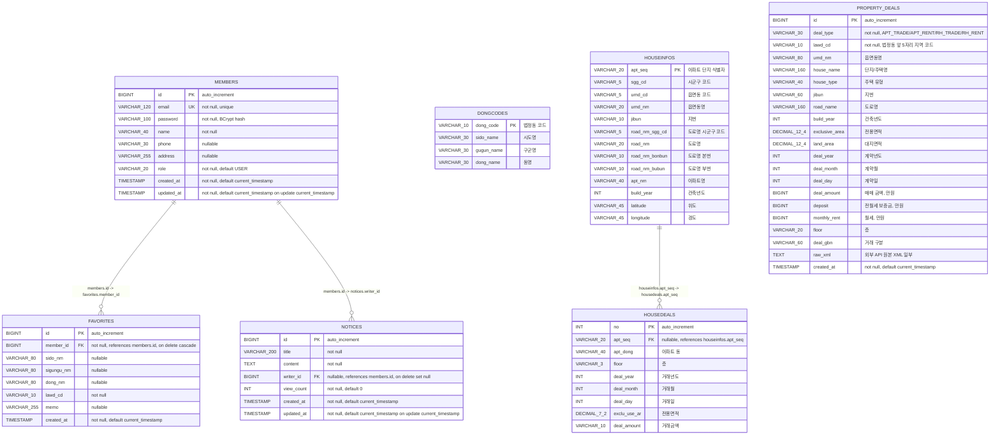
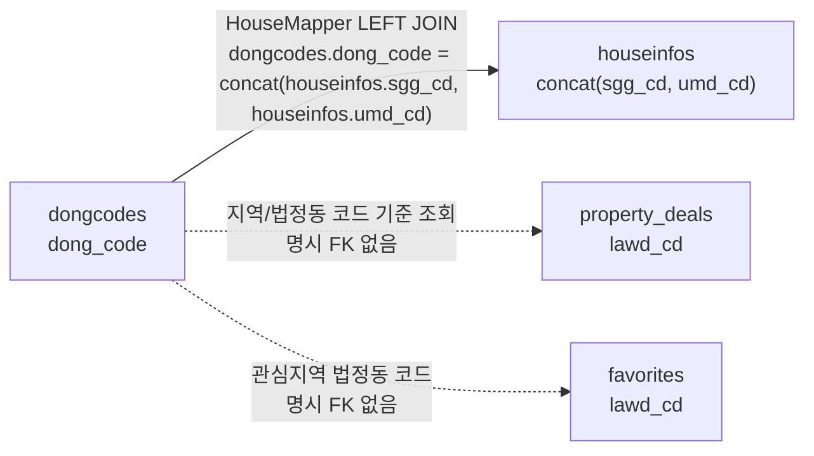

# SSAFY Home ERD

이 문서는 `src/main/resources/schema.sql` 기준의 데이터베이스 구조를 한눈에 보기 위한 ERD입니다.  
Mermaid의 관계 화살표는 **부모 테이블 → 자식 테이블** 방향으로 작성했습니다.

## 전체 ERD

## 조회/업무 맥락 참고 관계

아래 관계는 현재 DB에 `FOREIGN KEY` 제약으로 선언되어 있지는 않지만, Mapper 조회 또는 업무 의미상 함께 사용됩니다.

## 테이블별 상세

### members

회원과 로그인 세션의 기준 테이블입니다.

| 컬럼 | 타입 | 제약 | 설명 |
|---|---:|---|---|
| id | BIGINT | PK, AUTO_INCREMENT | 회원 ID |
| email | VARCHAR(120) | NOT NULL, UNIQUE | 로그인 이메일 |
| password | VARCHAR(100) | NOT NULL | BCrypt 암호화 비밀번호 |
| name | VARCHAR(40) | NOT NULL | 이름 |
| phone | VARCHAR(30) | NULL | 전화번호 |
| address | VARCHAR(255) | NULL | 주소 |
| role | VARCHAR(20) | NOT NULL, DEFAULT 'USER' | 권한 |
| created_at | TIMESTAMP | NOT NULL, DEFAULT CURRENT_TIMESTAMP | 생성일시 |
| updated_at | TIMESTAMP | NOT NULL, DEFAULT CURRENT_TIMESTAMP ON UPDATE CURRENT_TIMESTAMP | 수정일시 |

### favorites

회원별 관심지역 저장 테이블입니다.

| 컬럼 | 타입 | 제약 | 설명 |
|---|---:|---|---|
| id | BIGINT | PK, AUTO_INCREMENT | 관심지역 ID |
| member_id | BIGINT | FK, NOT NULL | `members.id` 참조, 회원 삭제 시 함께 삭제 |
| sido_nm | VARCHAR(80) | NULL | 시도명 |
| sigungu_nm | VARCHAR(80) | NULL | 시군구명 |
| dong_nm | VARCHAR(80) | NULL | 동명 |
| lawd_cd | VARCHAR(10) | NOT NULL | 법정동/지역 코드 |
| memo | VARCHAR(255) | NULL | 메모 |
| created_at | TIMESTAMP | NOT NULL, DEFAULT CURRENT_TIMESTAMP | 생성일시 |

관계:

### notices

공지사항 게시판 테이블입니다.

| 컬럼 | 타입 | 제약 | 설명 |
|---|---:|---|---|
| id | BIGINT | PK, AUTO_INCREMENT | 공지 ID |
| title | VARCHAR(200) | NOT NULL | 제목 |
| content | TEXT | NOT NULL | 내용 |
| writer_id | BIGINT | FK, NULL | `members.id` 참조, 회원 삭제 시 NULL 처리 |
| view_count | INT | NOT NULL, DEFAULT 0 | 조회수 |
| created_at | TIMESTAMP | NOT NULL, DEFAULT CURRENT_TIMESTAMP | 생성일시 |
| updated_at | TIMESTAMP | NOT NULL, DEFAULT CURRENT_TIMESTAMP ON UPDATE CURRENT_TIMESTAMP | 수정일시 |

관계:

### dongcodes

법정동 코드 기준 테이블입니다.

| 컬럼 | 타입 | 제약 | 설명 |
|---|---:|---|---|
| dong_code | VARCHAR(10) | PK, NOT NULL | 법정동 코드 |
| sido_name | VARCHAR(30) | NULL | 시도명 |
| gugun_name | VARCHAR(30) | NULL | 구군명 |
| dong_name | VARCHAR(30) | NULL | 동명 |

### houseinfos

아파트 단지 기본정보 테이블입니다.

| 컬럼 | 타입 | 제약 | 설명 |
|---|---:|---|---|
| apt_seq | VARCHAR(20) | PK, NOT NULL | 단지 식별자 |
| sgg_cd | VARCHAR(5) | NULL | 시군구 코드 |
| umd_cd | VARCHAR(5) | NULL | 읍면동 코드 |
| umd_nm | VARCHAR(20) | NULL | 읍면동명 |
| jibun | VARCHAR(10) | NULL | 지번 |
| road_nm_sgg_cd | VARCHAR(5) | NULL | 도로명 시군구 코드 |
| road_nm | VARCHAR(20) | NULL | 도로명 |
| road_nm_bonbun | VARCHAR(10) | NULL | 도로명 본번 |
| road_nm_bubun | VARCHAR(10) | NULL | 도로명 부번 |
| apt_nm | VARCHAR(40) | NULL | 아파트명 |
| build_year | INT | NULL | 건축년도 |
| latitude | VARCHAR(45) | NULL | 위도 |
| longitude | VARCHAR(45) | NULL | 경도 |

Mapper 조회 참고:

### housedeals

단지별 거래 이력 테이블입니다.

| 컬럼 | 타입 | 제약 | 설명 |
|---|---:|---|---|
| no | INT | PK, AUTO_INCREMENT | 거래 이력 번호 |
| apt_seq | VARCHAR(20) | FK, NULL | `houseinfos.apt_seq` 참조 |
| apt_dong | VARCHAR(40) | NULL | 아파트 동 |
| floor | VARCHAR(3) | NULL | 층 |
| deal_year | INT | NULL | 거래년도 |
| deal_month | INT | NULL | 거래월 |
| deal_day | INT | NULL | 거래일 |
| exclu_use_ar | DECIMAL(7,2) | NULL | 전용면적 |
| deal_amount | VARCHAR(10) | NULL | 거래금액 |

인덱스:

| 인덱스 | 컬럼 | 목적 |
|---|---|---|
| idx_housedeals_apt_seq | apt_seq | 단지 상세 거래 이력 조회 |

관계:

### property_deals

공공 API로 수집한 아파트/연립다세대 매매·전월세 실거래 통합 테이블입니다.

| 컬럼 | 타입 | 제약 | 설명 |
|---|---:|---|---|
| id | BIGINT | PK, AUTO_INCREMENT | 수집 거래 ID |
| deal_type | VARCHAR(30) | NOT NULL | 거래 유형: `APT_TRADE`, `APT_RENT`, `RH_TRADE`, `RH_RENT` |
| lawd_cd | VARCHAR(10) | NOT NULL | 법정동 앞 5자리 지역 코드 |
| umd_nm | VARCHAR(80) | NULL | 읍면동명 |
| house_name | VARCHAR(160) | NULL | 단지/주택명 |
| house_type | VARCHAR(40) | NULL | 주택 유형 |
| jibun | VARCHAR(60) | NULL | 지번 |
| road_name | VARCHAR(160) | NULL | 도로명 |
| build_year | INT | NULL | 건축년도 |
| exclusive_area | DECIMAL(12,4) | NULL | 전용면적 |
| land_area | DECIMAL(12,4) | NULL | 대지면적 |
| deal_year | INT | NULL | 계약년도 |
| deal_month | INT | NULL | 계약월 |
| deal_day | INT | NULL | 계약일 |
| deal_amount | BIGINT | NULL | 매매 금액, 만원 |
| deposit | BIGINT | NULL | 전월세 보증금, 만원 |
| monthly_rent | BIGINT | NULL | 월세, 만원 |
| floor | VARCHAR(20) | NULL | 층 |
| deal_gbn | VARCHAR(60) | NULL | 거래 구분 |
| raw_xml | TEXT | NULL | 외부 API 원본 XML 일부 |
| created_at | TIMESTAMP | NOT NULL, DEFAULT CURRENT_TIMESTAMP | 수집/저장 일시 |

인덱스:

| 인덱스 | 컬럼 | 목적 |
|---|---|---|
| idx_property_deals_region_month | lawd_cd, deal_year, deal_month | 지역/월별 거래 검색 |
| idx_property_deals_type_month | deal_type, lawd_cd, deal_year, deal_month | 거래유형/지역/월별 중복 삭제 및 요약 |

## 관계 요약

| 방향 | 관계 | DB 제약 | 삭제 정책 |
|---|---|---|---|
| `members.id` → `favorites.member_id` | 회원 1명은 관심지역 N개를 가짐 | FK | `ON DELETE CASCADE` |
| `members.id` → `notices.writer_id` | 회원 1명은 공지 N개를 작성 가능 | FK | `ON DELETE SET NULL` |
| `houseinfos.apt_seq` → `housedeals.apt_seq` | 단지 1개는 거래 이력 N개를 가짐 | FK | 기본 제한 |
| `dongcodes.dong_code` → `concat(houseinfos.sgg_cd, houseinfos.umd_cd)` | 지역명 표시용 조회 조인 | 명시 FK 없음 | 없음 |
| `dongcodes.dong_code/lawd_cd` → `property_deals.lawd_cd` | 지역 코드 기반 업무 참조 | 명시 FK 없음 | 없음 |
| `dongcodes.dong_code/lawd_cd` → `favorites.lawd_cd` | 관심지역 코드 업무 참조 | 명시 FK 없음 | 없음 |
